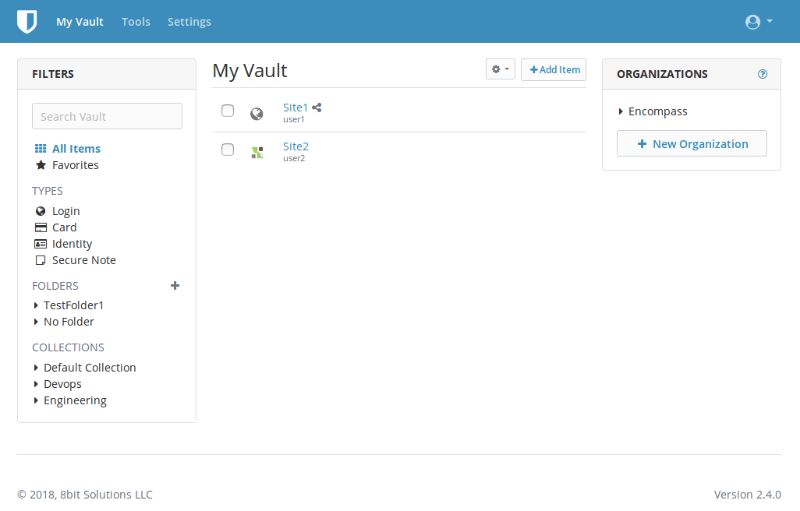

# bitwarden_rs Kubernetes deployment in AWS

These manifests provide way to deploy fully functional and secure [`bitwarden_rs`](https://github.com/dani-garcia/bitwarden_rs) application in Kubernetes hosted in AWS. The public access is provided via `nginx-ingress-controller` and AWS ELBv1. It provides little bit more than just a simple deployment but you can use all or just part of the manifests depending on your needs and setup.

This has been deployed and tested with Kubernetes `1.10` but should work with `1.9` and `1.8` too.

To install run:

```sh
$ kubectl apply -f kubernets/ -n some-namespace
```

To remove run:

```sh
$ kubectl delete -f kubernets/ -n some-namespace
```

## Nginx proxy

The [nginx-ingress-controller](https://github.com/kubernetes/ingress-nginx) is an excellent ingress controller for Kubernetes. See [this gist](https://gist.github.com/icicimov/316ebea363e98824ce7a9aa3d34ffbb4) to deploy the controller in K8S cluster in AWS if you don't have one already running. It will create an ELB with `proxy-protocol` enabled and TCP backend protocol so we can have support for Websockets needed for notifications (the controller has built in support for upgrade headers). 

If you already have a domain TLS certificate (maybe wildcard one) place it in a secret called `tls-secret` in the `default` namespace so Nginx can use it (optional).

Apart from that the gist provides features like [RBAC](https://kubernetes.io/docs/reference/access-authn-authz/rbac/), [HPA](https://kubernetes.io/docs/tasks/run-application/horizontal-pod-autoscale/) and [PDB](https://kubernetes.io/docs/tasks/run-application/configure-pdb/) to insure smooth proxy operation.

To find out more see the project's [excellent documentation](https://kubernetes.github.io/ingress-nginx/user-guide/nginx-configuration/).

## Let's Encrypt

See [this gist](https://gist.github.com/icicimov/5921ecac7a2179a7eb350e7f1ce8512b) for help about setting `cert-manager` in Kubernetes to manage Let's Encrypt certificates for your domain(s). If you decide to use it then apply this changes to `ingress.yml`:

```yaml
---
apiVersion: extensions/v1beta1
kind: Ingress
metadata:
  name: bitwarden
  labels:
    app: bitwarden
  annotations:
    ...
    kubernetes.io/tls-acme: "true"	# remove for GKE, see https://github.com/kubeflow/kubeflow/issues/4716
    certmanager.k8s.io/cluster-issuer: "letsencrypt-[staging|prod]"
spec:
  tls:
  - hosts:
    - bitwarden.domain.tld
    secretName: bitwarden-tls
  rules:
  ...
```

If successful, `cert-manager` will place the obtained LE certificate in the `bitwarden-tls` secret and manage it's renewal in the future.

## Settings

The Bitwarden related settings are set in the `configmap.yml` file. 

In case you want to use the email feature, the SMTP username and password need to be set in the `smtp-secret.yml` file as `base64` encoded values.

There is another option to provide TLS certificate for the domain in the `ingress.yml` via the `secretName` parameter if you haven't done that already in the Nginx proxy settings (the difference is this certificate applies to this Ingress only versus globally for all domains when set in Nginx as default certificate).

The application gets deployed as Kubernetes [StatefulSet](https://kubernetes.io/docs/concepts/workloads/controllers/statefulset/) and uses the [AWSElasticBlockStore storage class](https://kubernetes.io/docs/concepts/storage/storage-classes/#aws-ebs) to provide a persistent EBS volume for our data - The Storage Class name needs tobe set in the `statefulset.yaml` via the `storageClassName` parameter, some other settings like CPU and memory resources are set in the file and can be modified as needed. The app will run as user id 33 (www-data) instead of default root user for increased security. The included RBAC settings in the `rbac.yml` file provide access only to Kubernetes resources the app needs.

## Screenshot


